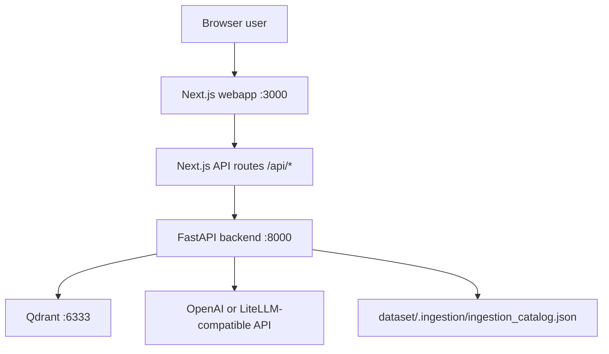

# Getting Started

This guide gives a new developer the mental model before the command list. Use [First Run](./03-FIRST-RUN.md) when you are ready to execute everything.

## System in One Minute

The project has five moving parts:

| Part | Path | What it does |
| --- | --- | --- |
| Ingestion | `src/ingestion/` | Scans `dataset/`, classifies files, extracts metadata, writes a JSON catalog. |
| Retrieval | `src/retrieval/` | Embeds artifacts, stores vectors in Qdrant, serves FastAPI endpoints. |
| Chatbot | `src/retrieval/chatbot/` | Classifies user intent, retrieves docs/artifacts/users, generates answers. |
| Webapp | `webapp/` | Next.js UI; calls local `/api/*` route handlers that proxy to FastAPI. |
| Operations | `airflow/`, `databricks/`, `rag-observability/`, `evaluation/` | Optional scheduling, cloud migration, tracing, metrics, and evaluation. |

## Local Runtime Topology



The browser never calls Python directly. The webapp calls its own API routes, and those route handlers call the Python backend using `PYTHON_API_URL` with `http://localhost:8000` as the default.

## Prerequisites

- Python 3.11+
- `uv` or `pip`
- Docker Desktop or another Docker runtime
- Node.js 18+
- An OpenAI API key for embeddings and LLM generation

Qdrant, FastAPI, and the webapp are enough for the core product. LiteLLM, Langfuse, Airflow, and Databricks are optional operational layers.

## Happy Path

```bash
uv sync
docker compose up -d qdrant
python -m src.ingestion.cli --root dataset --mode full
python -m src.retrieval.indexer --catalog dataset/.ingestion/ingestion_catalog.json --mode full
python -m src.retrieval.artifact_summary_indexer --catalog dataset/.ingestion/ingestion_catalog.json --mode full
python -m uvicorn src.retrieval.api:app --host 0.0.0.0 --port 8000
```

In a second terminal:

```bash
cd webapp
npm install
npm run dev
```

Open `http://localhost:3000`.

## What Must Exist Before Each Feature Works

| Feature | Required data |
| --- | --- |
| Workspace list and workspace profile | `dataset/.ingestion/ingestion_catalog.json` |
| Semantic artifact search | Qdrant `kubeflow_artifacts` collection |
| Artifact summary pages and artifact chatbot search | Qdrant `artifact_summaries` collection |
| User profile pages and people search | Qdrant `user_profiles` collection |
| Platform docs Q&A | Qdrant `platform_docs` collection populated from `platform_documents/*.docx` |
| Chatbot | `artifact_summaries`, `user_profiles`, `platform_docs`, and LLM access |

## Recommended Reading Order

1. [Installation](./02-INSTALLATION.md)
2. [First Run](./03-FIRST-RUN.md)
3. [Architecture](./04-ARCHITECTURE.md)
4. [Data Flows](./05-DATA-FLOWS.md)
5. [Troubleshooting](./operations/01-TROUBLESHOOTING.md)
