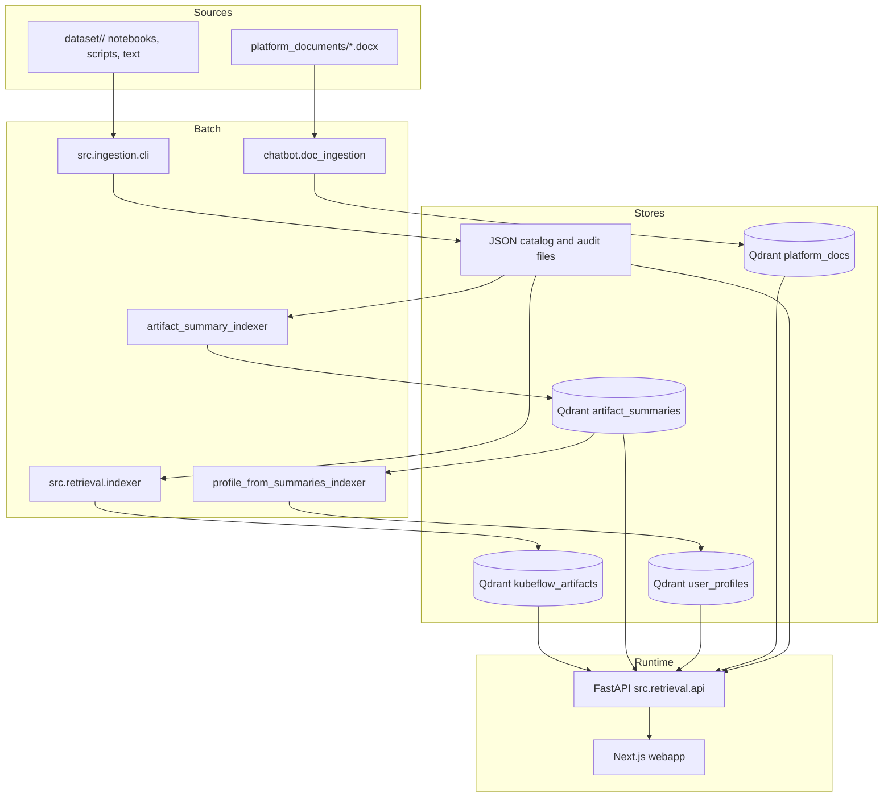
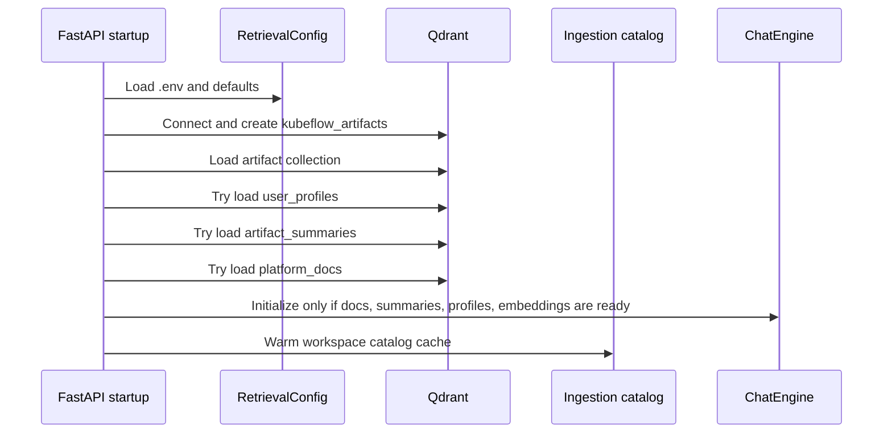
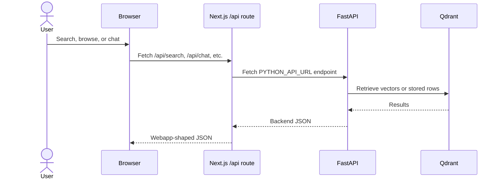

# Architecture

This page describes the current fixed-pipeline RAG architecture. The target
multi-agent evolution is documented separately in
[Multi-Agent RAG Architecture](./08-MULTIAGENT-RAG-ARCHITECTURE.md).

## High-Level View

## Runtime Components

| Component | Main files | Responsibility |
| --- | --- | --- |
| Ingestion pipeline | `src/ingestion/pipeline.py`, `src/ingestion/cli.py` | Discover workspace folders, classify supported files, extract notebook/script metadata, write catalog and audit JSON. |
| Retrieval backend | `src/retrieval/api.py` | FastAPI app, startup service wiring, health/metrics, workspace, search, profile, summary, chatbot, admin, and observability endpoints. |
| Vector store adapter | `src/retrieval/vector_store.py` | Qdrant connection, collection creation, vector insert/search/update/delete for artifact chunks. |
| Embedding service | `src/retrieval/embeddings.py` | OpenAI-compatible embedding generation and in-process cache. |
| Artifact summaries | `src/retrieval/artifact_summary_*` | LLM-generated artifact summaries and `artifact_summaries` collection management. |
| User profiles | `src/retrieval/user_profile_*`, `profile_from_summaries_indexer.py` | LLM-generated user profiles and `user_profiles` collection management. |
| Chatbot | `src/retrieval/chatbot/` | Intent classification, query rewriting, retrieval routing, name resolution, generation, formatting. |
| Observability | `src/observability/`, `rag-observability/` | LiteLLM/Langfuse trace metadata, scoring hooks, RAGAS-style background evaluation, optional Docker stacks. |
| Webapp | `webapp/app/`, `webapp/components/`, `webapp/lib/api.ts` | Next.js UI, route handlers that proxy to FastAPI, workspace/search/profile/chat pages. |
| Orchestration | `airflow/`, `databricks/` | Optional scheduled ingestion and Databricks-native migration path. |

## Backend Startup Sequence

User profile, artifact summary, and platform document stores are non-fatal at startup. The backend can still serve health, workspace, and search endpoints if those optional collections are not ready; `/chat` returns `503` until all chatbot stores are present.

## Request Boundary

## Deployment Shapes

| Shape | Use case | Notes |
| --- | --- | --- |
| Local developer | Daily coding and demos | Qdrant in Docker, FastAPI via Uvicorn, Next.js dev server. |
| Docker Compose | Integrated local services | `docker-compose.yml` defines Qdrant, backend, and webapp, but review environment values before relying on it. |
| Airflow | Scheduled local or VM ingestion | DAG runs incremental ingestion daily. |
| Databricks | Cloud-native migration | Replaces Qdrant with Vector Search, filesystem with Unity Catalog volumes, LiteLLM with Model Serving, and Airflow with Workflows. |
