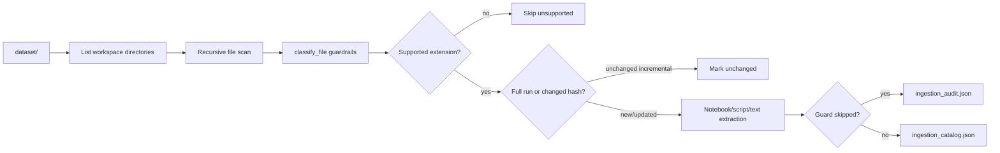
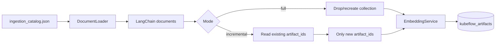
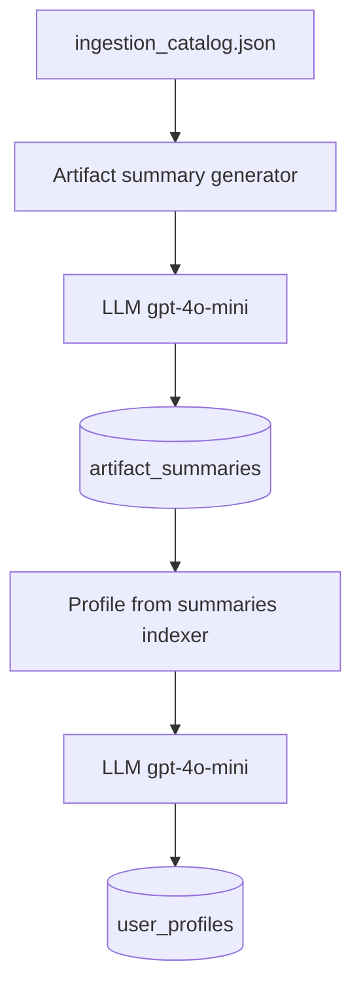
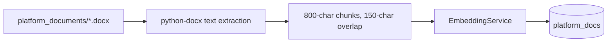
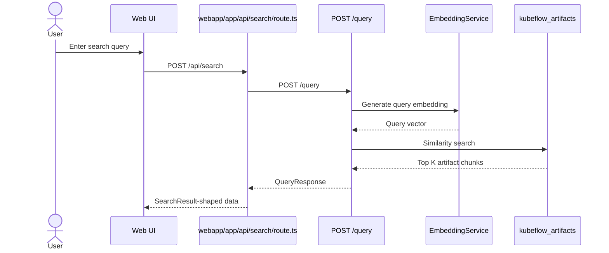
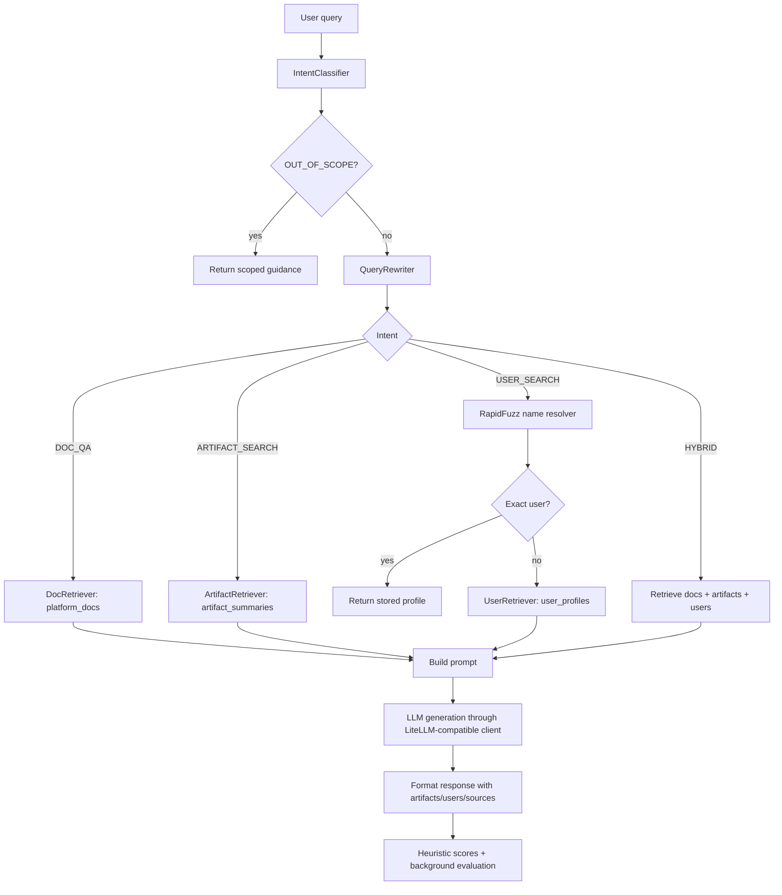
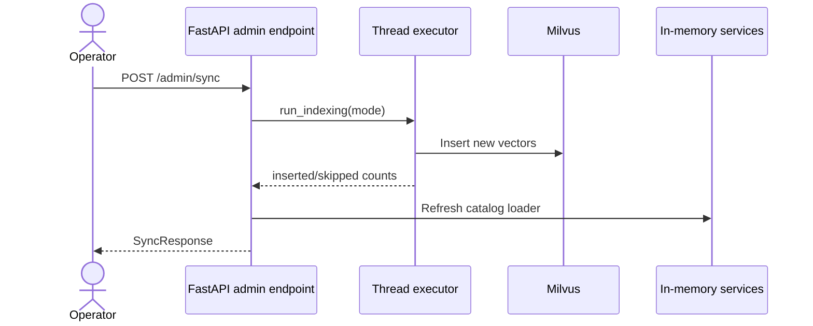
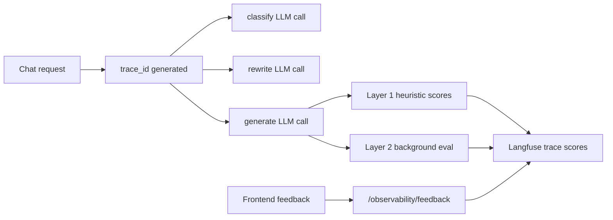

# Data Flows

## Ingestion Flow

Supported extensions are `.ipynb`, `.py`, `.scala`, `.sql`, `.txt`, and `.md`.

## Artifact Indexing Flow

Full mode rebuilds the artifact collection. Incremental mode skips already indexed `artifact_id` values.

## Summary and Profile Flow

Artifact summaries are the preferred source for user profile generation because they compress raw files into higher-signal user activity descriptions.

## Platform Docs Flow

The chatbot uses `platform_docs` for `DOC_QA` intent.

## Search Request Flow

## Chatbot Flow

## Admin Refresh Flow

Admin endpoints run batch work in a thread so the FastAPI event loop is not blocked.

## Observability Flow

