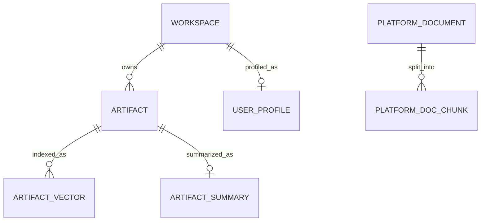

# Data Stores and Schemas

The local stack uses JSON files for ingestion metadata and Milvus for vector-backed runtime data. There is no relational database in the current local implementation.

## JSON Catalog

Location:

```text
dataset/.ingestion/ingestion_catalog.json
```

Top-level shape:

```json
{
  "workspaces": {
    "workspace_id": {
      "workspace_id": "workspace_id",
      "owner": "workspace_id",
      "root_path": "/absolute/path",
      "file_count": 10,
      "last_ingested_at": "2026-06-16T12:00:00",
      "status": "success",
      "source_coverage": {"code": 5},
      "notes": null
    }
  },
  "artifacts": {
    "workspace_id:relative/path.ipynb": {
      "artifact_id": "workspace_id:relative/path.ipynb",
      "workspace_id": "workspace_id",
      "relative_path": "relative/path.ipynb",
      "file_name": "path.ipynb",
      "file_type": "notebook",
      "mime_type": null,
      "size_bytes": 12345,
      "last_modified_at": "2026-06-16T12:00:00",
      "ingestion_status": "new",
      "classification": {
        "decision": "allowed",
        "matched_pattern": null,
        "category": "code",
        "metadata": {
          "tools": [],
          "databases": [],
          "tables": []
        }
      },
      "content_hash": "sha256",
      "capture_source": {"source_path": "/absolute/path"}
    }
  }
}
```

## JSON Audit

Location:

```text
dataset/.ingestion/ingestion_audit.json
```

Each record describes a guardrail decision, usually skipped files:

```json
{
  "audit_id": "audit_workspace:file",
  "artifact_id": "workspace:file",
  "workspace_id": "workspace",
  "run_id": "run_20260616120000",
  "decision": "skipped",
  "reason": "guardrail detected sensitive or unsupported artifact",
  "matched_pattern": "*.env",
  "metadata_snapshot": {
    "relative_path": ".env",
    "file_type": "text",
    "size_bytes": 100
  }
}
```

## Milvus Collections

### `kubeflow_artifacts`

Created by `src/retrieval/vector_store.py`.

| Field | Type | Notes |
| --- | --- | --- |
| `id` | `INT64`, primary, auto id | Milvus entity id |
| `artifact_id` | `VARCHAR(255)` | Catalog artifact id |
| `vector` | `FLOAT_VECTOR(EMBEDDING_DIMENSION)` | Default dimension `1536` |
| `content` | `VARCHAR(5000)` | Truncated document text |
| `metadata` | `JSON` | Workspace, path, file type, size, extracted metadata |

Index: HNSW, cosine similarity by default.

### `artifact_summaries`

Created by `src/retrieval/artifact_summary_store.py`.

| Field | Type | Notes |
| --- | --- | --- |
| `id` | `INT64`, primary, auto id | Milvus entity id |
| `user_id` | `VARCHAR(255)` | Workspace/user id |
| `artifact_id` | `VARCHAR(500)` | Artifact id |
| `artifact_summary` | `VARCHAR(1500)` | LLM-generated summary |
| `vector` | `FLOAT_VECTOR(EMBEDDING_DIMENSION)` | Summary embedding |
| `tags` | `VARCHAR(1000)` | Comma-separated tags |

### `user_profiles`

Created by `src/retrieval/user_profile_store.py`.

| Field | Type | Notes |
| --- | --- | --- |
| `id` | `INT64`, primary, auto id | Milvus entity id |
| `user_id` | `VARCHAR(255)` | Workspace/user id |
| `user_profile` | `VARCHAR(500)` | LLM-generated short profile |
| `vector` | `FLOAT_VECTOR(EMBEDDING_DIMENSION)` | Profile embedding |
| `tags` | `VARCHAR(1000)` | Comma-separated tags |

### `platform_docs`

Created by `src/retrieval/chatbot/doc_store.py`.

| Field | Type | Notes |
| --- | --- | --- |
| `id` | `INT64`, primary, auto id | Milvus entity id |
| `doc_id` | `VARCHAR(255)` | Source document id |
| `chunk_id` | `VARCHAR(512)` | Unique chunk id |
| `chunk_text` | `VARCHAR(4000)` | Extracted platform doc chunk |
| `source_file` | `VARCHAR(255)` | `.docx` filename |
| `vector` | `FLOAT_VECTOR(EMBEDDING_DIMENSION)` | Chunk embedding |

## Relationships



Logical join keys:

- `workspaces.workspace_id` to `artifacts.workspace_id`
- `artifacts.artifact_id` to `kubeflow_artifacts.artifact_id`
- `artifacts.artifact_id` to `artifact_summaries.artifact_id`
- `workspaces.workspace_id` to `artifact_summaries.user_id`
- `workspaces.workspace_id` to `user_profiles.user_id`

## Rebuild Rules

| Store | Rebuild command |
| --- | --- |
| Catalog and audit | `python -m src.ingestion.cli --root dataset --mode full` |
| `kubeflow_artifacts` | `python -m src.retrieval.indexer --catalog dataset/.ingestion/ingestion_catalog.json --mode full` |
| `artifact_summaries` | `python -m src.retrieval.artifact_summary_indexer --catalog dataset/.ingestion/ingestion_catalog.json --mode full` |
| `user_profiles` | `curl -X POST http://localhost:8000/admin/sync-profiles-from-summaries` |
| `platform_docs` | `curl -X POST "http://localhost:8000/admin/ingest-docs?drop_existing=true"` |
