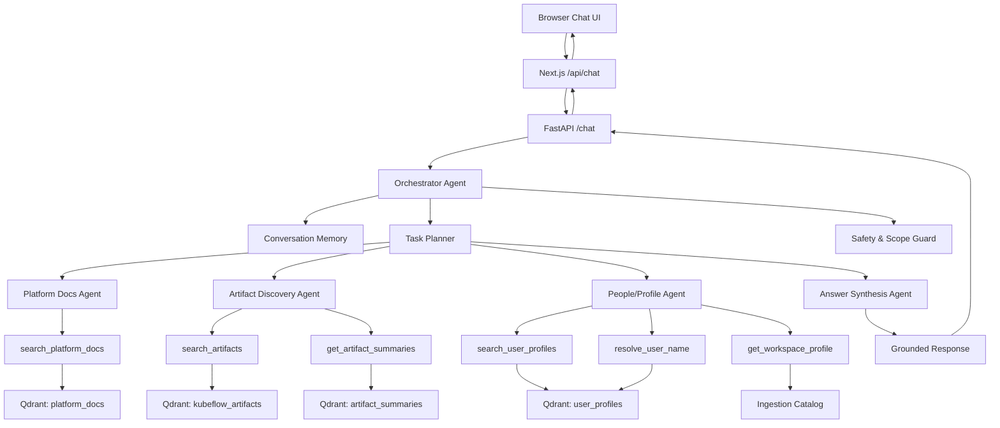

# Multi-Agent RAG Architecture

This document describes the target architecture for evolving the current routed
RAG chatbot into a multi-agent RAG system. The goal is to preserve the existing
retrievers, Qdrant collections, FastAPI contract, and UI while adding explicit
agent roles, shared task state, and controlled tool use.

## Current State

The current chatbot is a deterministic pipeline:

1. Classify the query intent.
2. Rewrite the query for retrieval.
3. Route to document, artifact, user, or hybrid retrievers.
4. Generate or format an answer.

This works well for simple lookup, but it is not agentic because it does not
plan, delegate, inspect intermediate outputs, or choose additional retrieval
steps based on partial results.

## Target State

The multi-agent system uses a supervising orchestrator and specialized agents.
Each agent has a narrow responsibility and calls a small set of typed tools.

## Agent Responsibilities

| Agent | Responsibility | Primary tools |
| --- | --- | --- |
| Orchestrator Agent | Owns turn state, decides whether to answer, ask a clarification, or call specialist agents. | planner, memory, guard |
| Platform Docs Agent | Answers how-to and platform behavior questions from documentation. | `search_platform_docs` |
| Artifact Discovery Agent | Finds notebooks, scripts, and code examples. | `search_artifacts`, `get_artifact_summaries` |
| People/Profile Agent | Resolves names and finds people by skills or current work. | `resolve_user_name`, `search_user_profiles`, `get_workspace_profile` |
| Answer Synthesis Agent | Produces final user-facing answer with citations and confidence. | specialist results |

## Shared Runtime Objects

| Object | Purpose |
| --- | --- |
| `AgentContext` | Per-turn state: query, history, trace ID, session ID, intent, decisions, evidence. |
| `AgentToolResult` | Typed return value from tool calls, including result count, confidence, and metadata. |
| `AgentDecision` | Orchestrator output: answer directly, ask clarification, or invoke another agent/tool. |
| `ConversationMemory` | Lightweight memory derived from prior chat turns, including pending disambiguation candidates. |

## Migration Plan

### Feature 1: Architecture Baseline

Add this architecture document and diagram so the branch has a clear target.

### Feature 2: Agent Runtime Skeleton

Introduce agent dataclasses and a minimal orchestrator behind the existing
`/chat` endpoint. The first version delegates to the current `ChatEngine` so the
external behavior remains stable.

### Feature 3: People/Profile Agent

Move the current user-name resolution and profile lookup flow into a dedicated
People/Profile Agent. Preserve exact follow-up disambiguation behavior.

### Feature 4: Retrieval Tool Layer

Wrap existing document, artifact, and user retrievers in typed tools. Tools
return structured evidence instead of raw retriever payloads.

### Feature 5: Planner and Multi-Step Answers

Add an orchestrator planner that can call multiple agents for hybrid requests,
inspect intermediate evidence, and ask clarifying questions when confidence is
low.

### Feature 6: Observability and Evaluation

Record agent decisions, tool calls, evidence counts, and synthesis confidence in
the existing trace metadata.

## Compatibility Rules

- Keep `/chat` request and response shape stable.
- Keep existing Qdrant collections unchanged.
- Keep full rebuild and incremental ingestion/indexing flows intact.
- Preserve deterministic exact-name lookup before semantic user search.
- Keep full agent planning opt-in until it is verified against the legacy flow.

## Feature Flags

The rollout should use environment variables:

| Variable | Default | Purpose |
| --- | --- | --- |
| `CHAT_AGENT_MODE` | `legacy` | `legacy` uses current `ChatEngine`; `orchestrated` uses the multi-agent path. |
| `AGENT_MAX_STEPS` | `4` | Maximum orchestrator tool/agent steps per chat turn. |
| `AGENT_ENABLE_PLANNER_LLM` | `false` | Enables LLM-based planning after deterministic agents are stable. |

