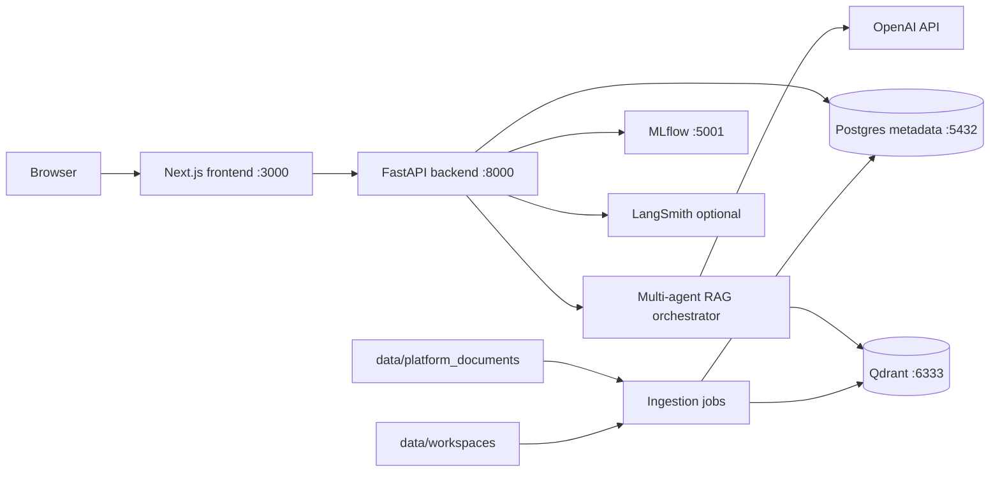
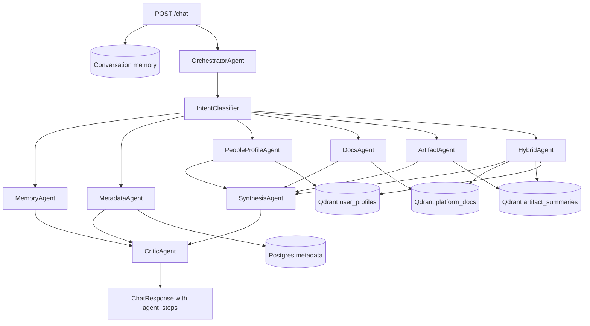

# Architecture

## Components

| Path | Responsibility |
| --- | --- |
| `frontend/` | Next.js UI, route handlers, API proxying, workspace/profile/search/chat pages. |
| `backend/src/ingestion/` | Scans user workspaces and writes workspace/artifact metadata to Postgres. |
| `backend/src/retrieval/` | FastAPI app, Qdrant stores, indexers, profile generation, and retrievers. |
| `backend/src/retrieval/agents/` | Multi-agent orchestration for people, artifacts, docs, and hybrid answers. |
| `backend/src/retrieval/chatbot/` | Intent classification, prompt loading, doc ingestion, response formatting, and session memory. |
| `backend/src/observability/` | LangSmith and MLflow tracing/scoring helpers. |
| `data/workspaces/` | Lightweight source workspaces used for profiles and artifact search. |
| `data/platform_documents/` | Platform documentation used by doc Q&A. |

## Multi-Agent Runtime

The orchestrator is the entry point for assistant reasoning. It creates one
`AgentContext` per turn, classifies the query, routes to the right specialist,
and returns `agent_steps` so the UI and traces can show which agents ran.

| Agent | Responsibility |
| --- | --- |
| `MemoryAgent` | Handles greetings, assistant self-introduction, and questions about the current conversation history. |
| `MetadataAgent` | Answers workspace/artifact/notebook/script counts from Postgres. |
| `PeopleProfileAgent` | Resolves exact/similar user names and searches people by expertise. |
| `DocsAgent` | Retrieves platform docs and answers how-to questions. |
| `ArtifactAgent` | Retrieves notebooks, Python files, Scala files, and artifact summaries. |
| `HybridAgent` | Coordinates docs, artifacts, and people retrieval for mixed questions. |
| `SynthesisAgent` | Composes final grounded answers from retrieved evidence. |
| `CriticAgent` | Performs deterministic response review before the answer is returned. |

Legacy `ChatEngine` remains available as a fallback runtime path, but in
`CHAT_AGENT_MODE=orchestrated` the common chat intents are handled by specialist
agents before fallback is considered.

## Metadata Source Of Truth

Postgres is the canonical metadata store for workspace and artifact state. It
stores workspace rows, artifact rows, and ingestion audit records with indexed
workspace/artifact lookups.

Qdrant remains the vector index for semantic search collections; it should not
be treated as the authoritative list of workspaces or artifacts.

## Collections

The app expects these Qdrant collections:

- `kubeflow_artifacts`
- `artifact_summaries`
- `user_profiles`
- `platform_docs`
