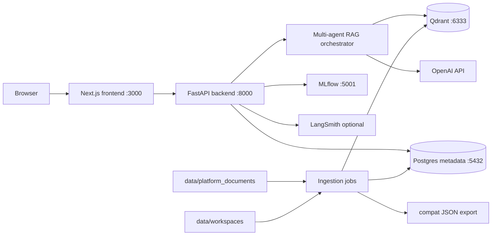

# Architecture

## Components

| Path | Responsibility |
| --- | --- |
| `frontend/` | Next.js UI, route handlers, API proxying, workspace/profile/search/chat pages. |
| `backend/src/ingestion/` | Scans user workspaces and writes workspace/artifact metadata to Postgres. |
| `backend/src/retrieval/` | FastAPI app, Qdrant stores, indexers, profile generation, and retrievers. |
| `backend/src/retrieval/agents/` | Multi-agent orchestration for people, artifacts, docs, and hybrid answers. |
| `backend/src/retrieval/chatbot/` | Intent classification, prompt loading, doc ingestion, response formatting, and session memory. |
| `backend/src/observability/` | LangSmith and MLflow tracing/scoring helpers. |
| `data/workspaces/` | Lightweight source workspaces used for profiles and artifact search. |
| `data/platform_documents/` | Platform documentation used by doc Q&A. |

## Metadata Source Of Truth

Postgres is the canonical metadata store for workspace and artifact state. It
stores workspace rows, artifact rows, and ingestion audit records with indexed
workspace/artifact lookups. The JSON file under `data/workspaces/.ingestion/`
is retained as a compatibility export while legacy indexing code is migrated.

Qdrant remains the vector index for semantic search collections; it should not
be treated as the authoritative list of workspaces or artifacts.

## Collections

The app expects these Qdrant collections:

- `kubeflow_artifacts`
- `artifact_summaries`
- `user_profiles`
- `platform_docs`
