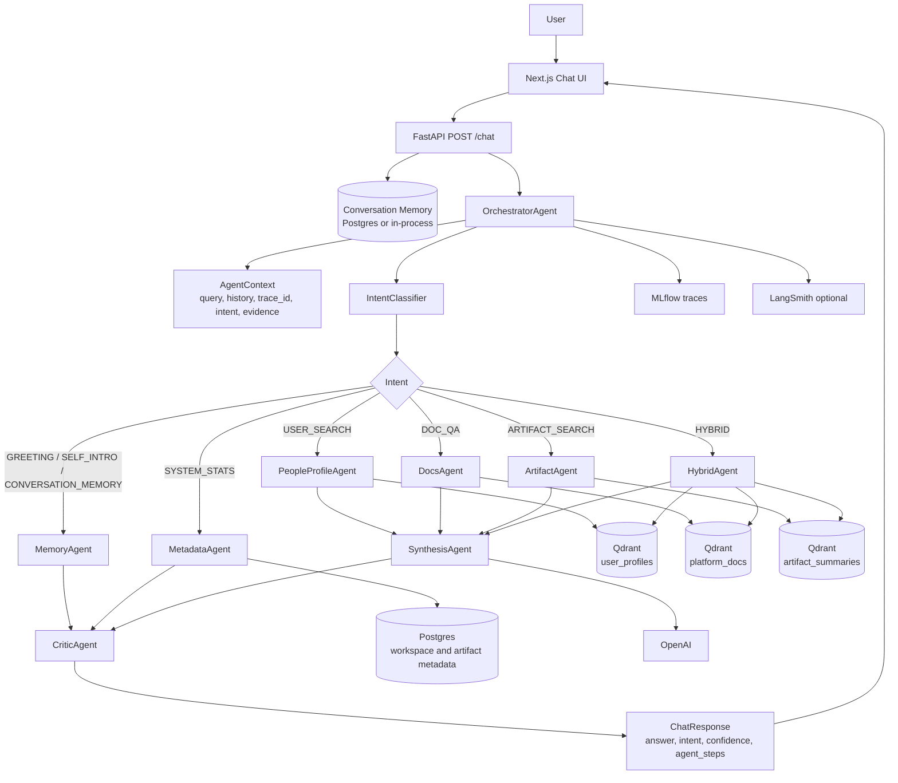
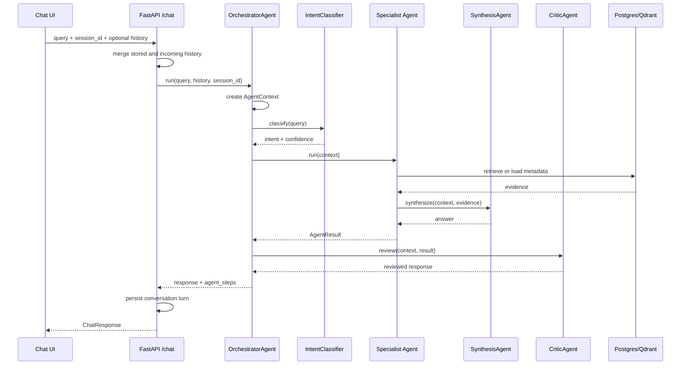

# Multi-Agent Architecture

This branch converts the assistant from an intent-routed RAG flow into an
orchestrated multi-agent runtime. The API response includes `agent_mode` and
`agent_steps`, so each answer can be inspected from the UI, logs, and tracing
backends.

## Runtime Diagram

## Agent Responsibilities

| Agent | Responsibility | Primary dependencies |
| --- | --- | --- |
| `OrchestratorAgent` | Creates turn context, classifies intent, routes to specialists, attaches `agent_steps`. | `ChatEngine` services, MLflow tracing |
| `MemoryAgent` | Handles greetings, assistant self-introduction, and current-conversation recap questions. | Conversation history |
| `MetadataAgent` | Answers system inventory questions such as workspace, artifact, notebook, and script counts. | Postgres metadata repository |
| `PeopleProfileAgent` | Resolves exact/similar user names, disambiguates profiles, and searches expertise semantically. | Qdrant `user_profiles`, user resolver |
| `DocsAgent` | Retrieves platform documentation and answers platform how-to questions. | Qdrant `platform_docs` |
| `ArtifactAgent` | Retrieves notebooks, scripts, and artifact summaries. | Qdrant `artifact_summaries` |
| `HybridAgent` | Searches docs, artifacts, and people together for mixed questions. | Qdrant docs/artifacts/users |
| `SynthesisAgent` | Produces grounded final prose from retrieved evidence. | OpenAI, prompt builders |
| `CriticAgent` | Reviews structured responses and lowers confidence for overconfident empty retrieval answers. | Structured response envelope |

## Turn Sequence

## Routing Rules

| Intent | Primary route |
| --- | --- |
| `GREETING` | `MemoryAgent` |
| `SELF_INTRO` | `MemoryAgent` |
| `CONVERSATION_MEMORY` | `MemoryAgent` |
| `SYSTEM_STATS` | `MetadataAgent` |
| `USER_SEARCH` | `PeopleProfileAgent`, then semantic people search when no name candidate exists |
| `DOC_QA` | `DocsAgent` |
| `ARTIFACT_SEARCH` | `ArtifactAgent` |
| `HYBRID` | `HybridAgent` |
| `OUT_OF_SCOPE` | Legacy fallback remains available through `ChatEngine` |

## Observability

Every orchestrated answer includes:

- `agent_mode`: currently `orchestrated`
- `agent_steps`: ordered list of agent actions, status, and details
- `trace_id`: request trace identifier

The frontend displays a compact `orchestrated • N steps` label under assistant
messages. Backend traces are also recorded through MLflow, with LangSmith
remaining optional.
