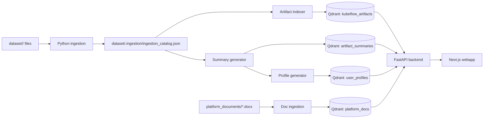

# Kubeflow Workspace Intelligence Documentation

This directory is the canonical documentation home for the project. Earlier notes were spread across the root README, `specs/`, `airflow/`, `databricks/`, `evaluation/`, `rag-observability/`, and `presentation/`; those files are still useful as source material, but new users should start here.

## Start Here

1. [Getting Started](./01-GETTING-STARTED.md) - shortest path to understanding and running the project.
2. [Installation](./02-INSTALLATION.md) - prerequisites, environment variables, and dependency setup.
3. [First Run](./03-FIRST-RUN.md) - exact commands for ingestion, indexing, API, chatbot, and webapp.
4. [Architecture](./04-ARCHITECTURE.md) - system components and Mermaid diagrams.
5. [Data Flows](./05-DATA-FLOWS.md) - ingestion, retrieval, chatbot, admin, and observability flows.
6. [Data Stores and Schemas](./06-DATABASE-SCHEMA.md) - JSON catalog and Qdrant collections.
7. [Technology Stack](./07-TECHNOLOGY-STACK.md) - runtime technologies and key dependencies.

## Component Guides

- [Ingestion Pipeline](./components/01-INGESTION-PIPELINE.md)
- [Retrieval and Chatbot](./components/02-RETRIEVAL-AND-CHATBOT.md)
- [Webapp](./components/03-WEBAPP.md)
- [Orchestration](./components/04-ORCHESTRATION.md)
- [Observability and Evaluation](./components/05-OBSERVABILITY-AND-EVALUATION.md)

## Reference

- [API Reference](./api/01-API-REFERENCE.md)
- [Troubleshooting](./operations/01-TROUBLESHOOTING.md)
- [Project Structure](./development/01-PROJECT-STRUCTURE.md)

## What This Project Does

Kubeflow Workspace Intelligence scans user workspace folders, extracts metadata from notebooks, scripts, and text files, indexes the material into Qdrant, generates artifact summaries and user profiles with an LLM, and exposes search, browsing, profile, and chatbot experiences through a FastAPI backend and Next.js frontend.

## Why Documentation Was Scattered

The repository grew in phases:

| Location | Purpose | Canonical replacement |
| --- | --- | --- |
| `README.md` | Early full-stack runbook | `01-GETTING-STARTED.md`, `03-FIRST-RUN.md` |
| `specs/001-*` | Ingestion implementation planning | `components/01-INGESTION-PIPELINE.md` |
| `specs/002-*` | Retrieval and LangChain planning | `components/02-RETRIEVAL-AND-CHATBOT.md` |
| `specs/003-*` | Frontend planning | `components/03-WEBAPP.md` |
| `airflow/README.md` and DAG | Scheduler notes | `components/04-ORCHESTRATION.md` |
| `databricks/README.md` | Databricks migration notes | `components/04-ORCHESTRATION.md` |
| `rag_observability_overview.md`, `rag-observability/` | Observability design and Docker stacks | `components/05-OBSERVABILITY-AND-EVALUATION.md` |
| `evaluation/README.md` | Chatbot evaluation dataset | `components/05-OBSERVABILITY-AND-EVALUATION.md` |
| `presentation/` | Slide decks and Mermaid diagrams | Referenced by architecture docs as historical diagrams |

When changing behavior, update the page in `docs/` first. Source-specific notes can remain next to their code, but they should link back to these canonical docs.
