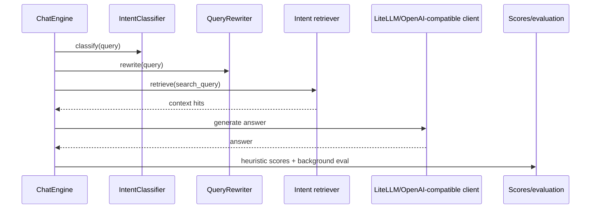

# Retrieval and Chatbot

## Retrieval Purpose

Retrieval turns catalog artifacts, artifact summaries, user profiles, and platform docs into searchable vector collections.

## Main Collections

| Collection | Producer | Consumer |
| --- | --- | --- |
| `kubeflow_artifacts` | `src.retrieval.indexer` | `/query`, search UI |
| `artifact_summaries` | `src.retrieval.artifact_summary_indexer` | summary pages, artifact chatbot retrieval, profile generation |
| `user_profiles` | `profile_indexer` or `profile_from_summaries_indexer` | user profile pages, people search |
| `platform_docs` | `src.retrieval.chatbot.doc_ingestion` | platform docs Q&A |

## Indexing Commands

```bash
python -m src.retrieval.indexer --catalog dataset/.ingestion/ingestion_catalog.json --mode full
python -m src.retrieval.artifact_summary_indexer --catalog dataset/.ingestion/ingestion_catalog.json --mode full
curl -X POST http://localhost:8000/admin/sync-profiles-from-summaries
curl -X POST http://localhost:8000/admin/ingest-docs
```

## API Runtime

`src/retrieval/api.py` wires global services on startup:

- `RetrievalConfig`
- `VectorStore`
- `EmbeddingService`
- `QueryProcessor`
- `WorkspaceProfiler`
- `UserProfileStore`
- `ArtifactSummaryStore`
- `DocumentChunkStore`
- `ChatEngine`

The chatbot is initialized only when profile, summary, doc, and embedding services are available.

## Chatbot Intent Routing

| Intent | Retrieval path |
| --- | --- |
| `DOC_QA` | Search `platform_docs`; answer from platform documentation. |
| `ARTIFACT_SEARCH` | Search `artifact_summaries`; return artifact recommendations. |
| `USER_SEARCH` | First try RapidFuzz name resolution, then fall back to `user_profiles` vector search. |
| `HYBRID` | Search docs, artifacts, and users. |
| `OUT_OF_SCOPE` | Return a fixed boundary message without retrieval or generation. |

## Chatbot Sequence



## Important Failure Modes

- `/chat` returns `503` when any required chatbot collection is missing.
- Embedding dimension mismatch causes Milvus insert/search errors.
- LiteLLM not running can break chatbot LLM calls because `make_openai_client()` points at `LITELLM_BASE_URL`.
- Empty or stale `artifact_summaries` will produce weak user profiles.
