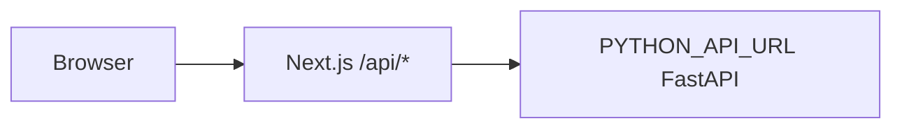

# Webapp

## Purpose

The webapp is a Next.js application that provides workspace browsing, semantic search, profile views, analytics, settings, and the AI assistant.

## Code Map

| Path | Responsibility |
| --- | --- |
| `webapp/app/page.tsx` | Main landing/search experience. |
| `webapp/app/search/page.tsx` | Search page. |
| `webapp/app/workspaces/` | Workspace list, detail, and creation screens. |
| `webapp/app/user-profiles/page.tsx` | User profile browsing. |
| `webapp/app/analytics/page.tsx` | Analytics dashboard. |
| `webapp/app/api/*/route.ts` | Server-side API proxy routes to FastAPI. |
| `webapp/components/` | Shared UI, search, workspace, chatbot, and layout components. |
| `webapp/lib/api.ts` | Frontend API client and React Query keys. |
| `webapp/types/index.ts` | Shared frontend types. |

## Proxy Model



The browser calls relative URLs such as `/api/search`. Next.js route handlers call the Python backend. This avoids exposing backend topology to browser code and allows response-shape transformations.

## Key Route Mappings

| Webapp route | Python backend route |
| --- | --- |
| `POST /api/search` | `POST /query` |
| `POST /api/chat` | `POST /chat` |
| `GET /api/workspaces` | `GET /workspaces` |
| `GET /api/workspaces/[id]` | `GET /workspaces/{id}` |
| `GET /api/workspaces/[id]/profile` | `GET /profile/workspace/{id}` |
| `GET /api/user-profiles` | `GET /user-profiles` |
| `GET /api/artifact-summaries` | `GET /artifact-summaries` |
| `POST /api/admin/sync` | `POST /admin/sync` |
| `POST /api/admin/ingest-docs` | `POST /admin/ingest-docs` |

## Local Development

```bash
cd webapp
PYTHON_API_URL=http://localhost:8000 npm run dev
```

Open `http://localhost:3000`.

## Build

```bash
cd webapp
npm run build
npm run start
```

## Notes

- `NEXT_PUBLIC_API_URL` is not used by the current `webapp/lib/api.ts`; it intentionally uses relative URLs.
- Server-side route handlers use `PYTHON_API_URL`.
- If the UI says the backend is unavailable, check the Python API first with `curl http://localhost:8000/health`.
