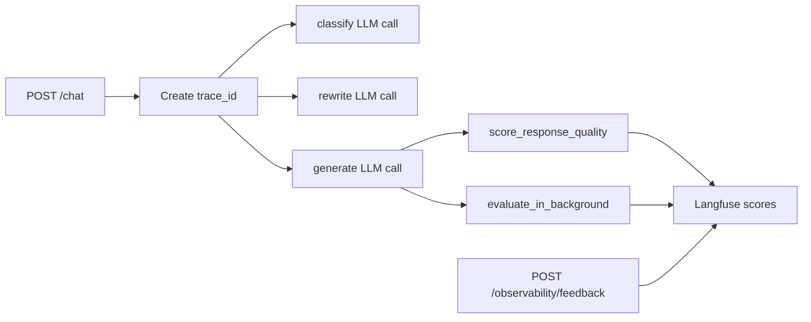

# Observability and Evaluation

## Layers

| Layer | Tooling | Purpose |
| --- | --- | --- |
| LLM traces | LiteLLM + Langfuse | Capture model calls, latency, token usage, cost, prompts, responses, and trace ids. |
| RAG quality | RAGAS-style scoring in `src/observability/layer2.py` | Measure faithfulness, answer relevance, context quality, and profile relevance. |
| App metrics | FastAPI `/metrics`, optional Prometheus/Grafana | Track uptime, query count, average query time, error rate, and process memory. |
| Drift | Evidently patterns from `rag_observability_overview.md` | Detect query/embedding distribution changes over time. |

## Runtime Trace Flow



## Local LiteLLM and Langfuse

LiteLLM:

```bash
cd rag-observability/litellm
cp .env.example .env
docker compose up -d
```

Langfuse:

```bash
cd rag-observability/langfuse
cp .env.example .env
docker compose up -d
```

Then set:

```bash
LITELLM_BASE_URL=http://localhost:4000
LITELLM_API_KEY=sk-1234
```

## Backend Metrics

The current `/metrics` endpoint returns application-level JSON:

```json
{
  "uptime_seconds": 100.0,
  "total_queries": 3,
  "avg_query_time_ms": 120.0,
  "error_rate": 0.0,
  "memory_usage_mb": 150.0
}
```

It is not currently a Prometheus text-format endpoint. Add Prometheus instrumentation before scraping it with Prometheus.

## Feedback Endpoints

| Endpoint | Purpose |
| --- | --- |
| `POST /observability/score` | Attach a named numeric score to a trace id. |
| `POST /observability/feedback` | Attach thumbs-up/thumbs-down user feedback to a trace id. |

## Evaluation Dataset

Files:

- `evaluation/README.md`
- `evaluation/chatbot_eval_dataset.json`
- `evaluation/run_eval.py`

The dataset covers `DOC_QA`, `ARTIFACT_SEARCH`, `USER_SEARCH`, `HYBRID`, `OUT_OF_SCOPE`, and edge cases.

Run:

```bash
python evaluation/run_eval.py
```

Before running evaluation, make sure:

- FastAPI is up.
- Milvus contains `artifact_summaries`, `user_profiles`, and `platform_docs`.
- LiteLLM/Langfuse is configured if you want trace-level validation.

## Key Invariants

- `OUT_OF_SCOPE` requests should classify and return without retrieval.
- Exact `USER_SEARCH` name matches should return stored profile content without a generation step.
- Non-out-of-scope generation paths should have retrieved sources unless the answer clearly says no relevant source was found.
- Background evaluation should not block the user response.
